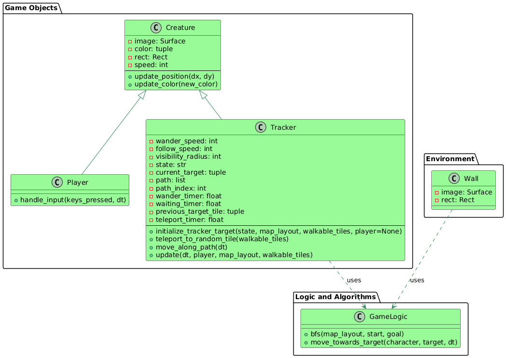

# Alienation

**2024 Aoop Group 5 期末專題遊戲**

---

## 目錄

- [介紹](#介紹)
- [特色](#特色)
- [遊戲玩法](#遊戲玩法)
  - [控制方式](#控制方式)
  - [目標](#目標)
- [AI 行為](#ai-行為)
  - [異形警戒系統](#異形警戒系統)
  - [異形移動模式](#異形移動模式)
- [美術資源](#美術資源)
- [安裝指南](#安裝指南)
- [前置需求](#前置需求)
- [Structure](#Structure)
- [Class diagram](#Class_diagram)

---

## 介紹

*Alienation* 是由 Aoop Group 5 團隊於 2024 年開發的生存恐怖遊戲，作為期末專題。
遊戲靈感來自經典的《異形》（Alien）系列電影以及遊戲《Alien: Isolation》。
玩家將在迷宮般的宇宙飛船中潛行，躲避不斷追擊的異形，目標是救出船上的貓咪 "K"，並成功逃離飛船。

---

## 特色

- **動態 AI 行為：** 異形根據玩家的行動調整警戒值，改變追蹤和追擊行為。
- **複雜的關卡設計：** 探索迷宮般的飛船走廊，擁有多條路徑和隱藏區域。
- **救援任務：** 尋找並救出 "K"，船上的貓咪，可能提供獨特的協助或解鎖特殊能力。
- **資源管理：** 管理有限的資源，如手電筒電池、醫療包和鑰匙，以求生存。
- **氛圍音效設計：** 沉浸式音效提升緊張感，增強恐怖體驗。
- **解謎元素：** 解決環境謎題以解鎖飛船的新區域，推進遊戲進程。
- **美術資源：** 包括詳細的玩家角色、異形模型、飛船地圖以及引人入勝的過場動畫。

---

## 遊戲玩法

### 控制方式

- **W:** 前進
- **S:** 後退
- **A:** 向左移動
- **D:** 向右移動
- **C:** 蹲下（減少可見性和噪音，有助於潛行）
- **Space:** 奔跑（快速穿越區域或逃離威脅）

### 目標

1. **導航飛船：**
   - 探索迷宮般的走廊，同時避開異形的偵測。

2. **救援 "K"：**
   - 定位並安全救出貓咪 "K"，可能需要克服特定挑戰或解謎。

3. **成功逃脫：**
   - 找到逃生艙，確保安全離開飛船，同時管理資源並避開或對抗異形。

---

## AI 行為

### 異形警戒系統

- **警戒值調整：** 異形根據玩家的移動和行動調整其警戒值。
  - **警戒值1（追蹤）：** 異形開始追蹤玩家的位置。
  - **警戒值2（追擊）：** 異形主動追擊玩家，採取更積極的行動策略。

### 異形移動模式

- **亂走：** 異形在飛船內隨機漫步，增加不可預測性。
- **隨機瞬移：** 異形能在特定區域內隨機瞬移，給玩家帶來突如其來的威脅。

---

## 美術資源

遊戲包含多樣的美術資源以提升視覺體驗：

- **玩家角色：** 詳細的主角模型和動畫。
- **異形：** 獨特的異形模型和動畫。
- **飛船地圖：** 覆蓋不同區域的詳細地圖，如醫療艙、工程艙和貨物艙。
- **過場動畫：** 引人入勝的動畫序列，用於推進故事情節。

---

## 安裝指南

1. **Clone the repository**  
   使用 Git 將專案複製到本地環境：  
   ```bash
   git clone git@github.com:bensonchen-del/Alienation.git
   ```

2. **進入專案目錄**  
   切換到遊戲的根目錄：  
   ```bash
   cd Alienation/Pygame
   ```

3. **安裝必要的依賴項**  
   使用 pip 安裝遊戲運行所需的依賴項：  
   ```bash
   pip install -r requirements.txt
   ```
   > **注意：** 確保您的環境中已安裝 `pip`，並且使用的 Python 版本為 3.7 或更高。

4. **運行遊戲**  
   在 Linux 環境中啟動遊戲：  
   ```bash
   python3 starting.py
   ```

---

## 前置需求

- [Python](https://www.python.org/)（版本 3.7 或更高）
- [Pygame](https://www.pygame.org/)（版本 2.0 或更高）

---

## Structure


---

## Class diagram

